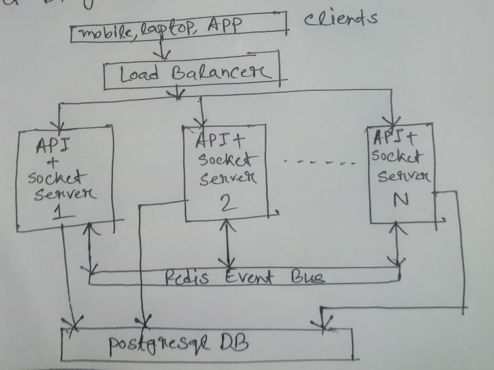

# ARCHITECTURE.md

## 1.Architecture overview — how components interact

This system follows a horizontally scalable architecture where multiple instances handle both API and WebSocket connections.At first clients(browser,app) traffics routed to different instances,Hence A User may connected to server 1 ,other user in server 2. Then Each Server subsribes to Redis Event bus to listen  any incoming events from other instances and also send event to event bus.So If Two user connected to different server instance but they are chatting within a room the redis bus seemlessly handle the socket events so that they can chat with each other. Here We are using a single db instances to keep persistent data.All of the instances use this same db.Here We also use redis to cache livedynamic data such as user counts in a room, session token etc. 

The diagram below illustrates the overall component interaction:

---

## 2. Explain how session tokens are generated, stored, and expired.

> 

When a user calls the login endpoint, a session token is generated and stored in Redis with a TTL of 86,400 seconds (24 hours), after which it expires automatically. The token itself carries no embedded information. Instead, it serves as a key to retrieve user data stored as a value in Redis, following this structure:

session:${sessionToken} → {userId, userName, createdAt}

The session token is a 32-byte random string encoded in hexadecimal, prefixed with sess_. The final format looks like this: sess_{opaque string}

---

## 3. How Redis pub/sub enables WebSocket fan-out across multiple instances

> 

When your WebSocket server runs on multiple instances (horizontal scaling), each instance only knows about the clients connected to itself. Without coordination, messages won’t reach users connected to other instances. This is where Redis Pub/Sub comes in.It is a lightweightmessaging system where publisher send message to a channel and subscriber listens to that channel.Here redis acts as message brokers,delivering messages to all subscibed instances.

---

## 4. Estimated concurrent user capacity on a single instance, with your reasoning

> 

Based on the stated assumptions—50% user activity during peak load, each active user sending one message every two seconds, even distribution across rooms with an average of 20 users per room, and small JSON payloads without media—the system is estimated to support approximately 1,500 concurrent users. Running on a single instance with 1 vCPU, 4 GB RAM, using Node.js for WebSocket connections, PostgreSQL for persistence, and Redis for pub/sub coordination, the primary bottleneck is CPU, driven by message processing and WebSocket fan-out. Memory usage, however, remains within safe operational limits.

---

## 5. Scaling to 10× Load

> What changes would you make to handle 10 times more traffic?

To handle a 10x increase in load (15,000 users), server responsibilities need to be distributed. Two types of horizontally scalable servers are introduced: API servers for handling HTTP requests, and socket servers for managing socket connections. Each can be scaled independently.

To enable communication between two users in the same room, service discovery is implemented. It tracks which socket instance each user is connected to, allowing messages to be routed directly to that instance instead of being broadcasted. A Redis cluster is used to cache dynamic, real-time data.

The database also becomes a bottleneck under this load. To address this, two database types are used: PostgreSQL for managing users and rooms, and a key-value database for storing messages. The key-value database is sharded by room ID, with read replicas for each shard.

Additionally, an asynchronous message broker like Kafka is introduced between the API server and the database to handle database writes in the background.

---

## 6. Known Limitations / Trade-offs

> Describe any limitations or compromises in your design.

- Single DB bottleneck(Single Point of Failure)
- Redis bottleneck (Single Source of Failure)
- A Single Redis can be overwhelmed easily.
- Messages may be out of order for different user
- There is no acknowledgement for publish and subscribe.
